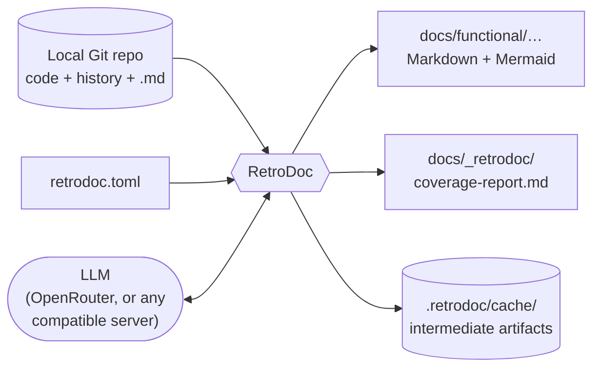
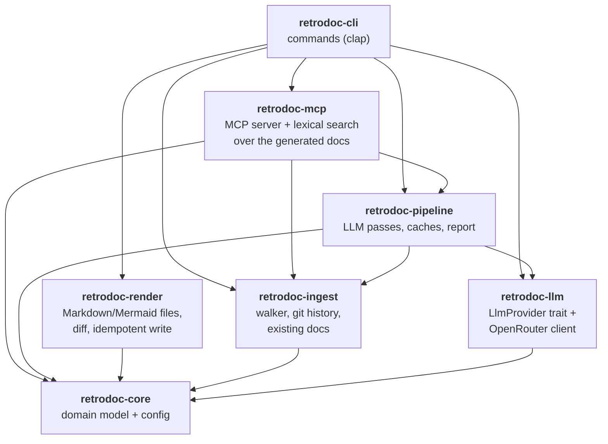
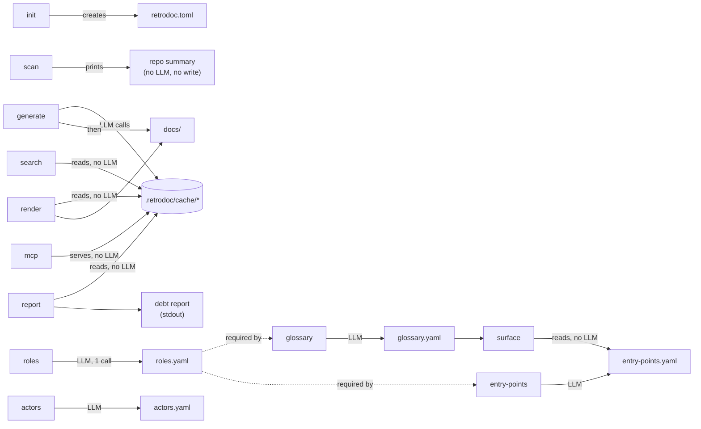
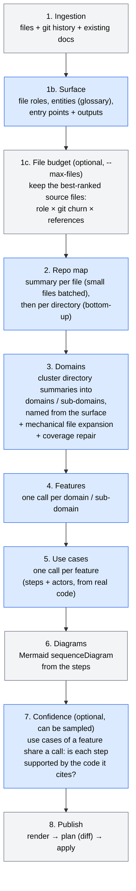
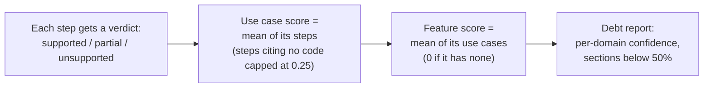
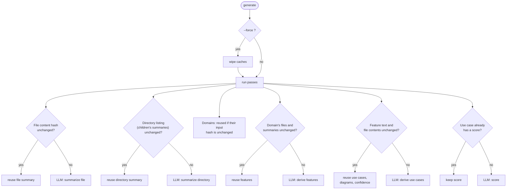
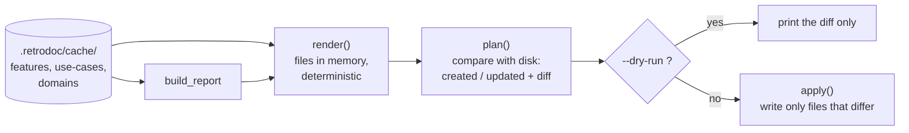
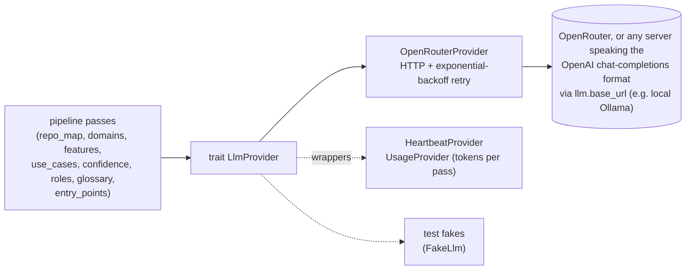
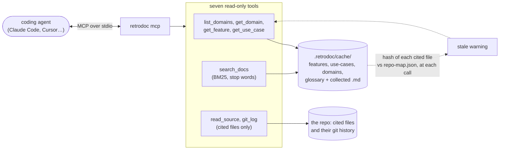

# RetroDoc architecture (high level)

This page explains **how RetroDoc works** with a few simple diagrams. It is a map, not a spec: for the
roadmap and the rationale behind each choice see [`PLAN.md`](../PLAN.md), for the product vision see
[`PRODUCT.md`](../PRODUCT.md), and for per-module details read the doc comments in the code.

## 1. What RetroDoc does

RetroDoc reads a local Git repo (code, commit history, existing Markdown) and asks an LLM, step by
step, to rebuild the **functional documentation** the project never had: domains → features → use
cases → diagrams, each with a **confidence score** telling how well the code supports the claim.



## 2. The crates

Seven crates; dependencies only point downwards (no cycles).



| Crate | Role in one sentence |
|---|---|
| `retrodoc-core` | Shared vocabulary: `Domain`, `Feature`, `UseCase`, `Step`, `ConfidenceScore`, and the `retrodoc.toml` config. |
| `retrodoc-ingest` | Reads the repo: files (honouring `.gitignore`, classified `Source`/`Test`/`Markdown`/`Other`), git history in one pass, existing docs. |
| `retrodoc-llm` | Talks to the model. `LlmProvider` is a trait; the only implementation is `OpenRouterProvider` (HTTP, retry with backoff on 429/5xx). `UsageProvider` wraps it to count calls and tokens per pass. |
| `retrodoc-pipeline` | The brain: one module per pass, plus caches, fingerprints and the debt report. |
| `retrodoc-render` | Turns the result into Markdown files, compares with disk, writes only what changed. |
| `retrodoc-mcp` | Read-only access to the generated docs for LLM agents, without any LLM call. The BM25 search behind `retrodoc search` and the MCP server (`retrodoc mcp`, `rmcp`, stdio) with its seven read-only tools. |
| `retrodoc-cli` | The `retrodoc` binary: parses arguments and wires the crates together. |

## 3. The commands



- `generate` is the main command; `render` and `report` replay the *last* `generate` without any LLM call.
- `roles`, `glossary` and `entry-points` (phase 7) are also run, incrementally, by `generate` as its "surface" step; the standalone commands let you run and inspect each one. `surface` prints what the domain clustering receives from them (no LLM).
- `search "<query>"` ranks the generated docs and the collected docs lexically (no LLM). `mcp` serves them to a coding agent over stdio (`list_domains`, `get_domain`, `get_feature`, `get_use_case`, `search_docs`, plus `read_source` and `git_log` on the files the docs cite; no LLM, the agent reasons): the first form of "ask the documentation" (phase 9, `PLAN.md` §7.3). Answers warn when a cited file changed since generation (its hash against the one in `repo-map.json`); the code and git tools refuse any file the docs don't cite and anything outside the repo root.

## 4. The `generate` pipeline

This is the core flow. Blue-ish steps call the LLM; the others are deterministic.



What each pass hands to the next, and where it is saved:

| # | Pass (module) | Input | Output | Saved in `.retrodoc/cache/` |
|---|---|---|---|---|
| 1 | ingest (`retrodoc-ingest`) | repo path | files, history, existing docs | — (recomputed) |
| 1c | `ranking.rs` (only with a budget) | source files + roles + history + references | the N best-ranked files; the rest is left out | `scope.yaml` |
| 2 | `repo_map/` | source files + history | file and directory summaries | `repo-map.json` |
| 3 | `domains/` | directory summaries + doc titles + the surface (entities, entry points by resource) | `DomainMap` (every source file in exactly one domain) | `domains.yaml` |
| 4 | `features/` | one domain + its files' summaries | `Feature`s grounded on a validated subset of files | `features.yaml` |
| 5 | `use_cases/` | one feature + its entry points + the code they run (`slices.rs`) + the business actors (`actors.rs`), else its files' excerpts | `UseCase`s with steps and actors | `use-cases.yaml` |
| 6 | `diagrams.rs` | use case steps (the technical level; each use case also carries a business `narrative`) | Mermaid text attached to each use case | `use-cases.yaml` |
| 6b | `vocabulary.rs` | use case narrative + entity/actor names | business-language score on each use case (no LLM) | `use-cases.yaml` |
| 7 | `confidence/` | use case + the code its steps cite | scores on use cases and features | `features.yaml`, `use-cases.yaml` |
| 8 | `report.rs` + `retrodoc-render` | all of the above | Markdown files + debt report | — (written to `docs/`) |

### Safety nets built into the passes

- **Domains coverage is enforced by construction.** If the LLM forgets a file it goes into a synthetic
  "uncategorized" domain; a file assigned twice keeps the first assignment; invented paths are dropped.
  The run is never failed for this, and the repairs are reported (`CoverageReport`).
- **Lenient JSON.** LLM answers are parsed leniently (first JSON value, code fences tolerated). An
  unparseable answer is retried once, then that single unit is skipped with a warning instead of
  aborting the run (`response.rs`).
- **Grounding.** Source references to files outside the feature are dropped; a use case that cites no
  readable code scores 0 without even calling the LLM.

### How the confidence score is computed



An unparseable verdict leaves the use case **unscored** (`None`), which the report lists separately.

## 5. Incremental re-run

Re-running `generate` should not pay for the LLM twice. Fingerprints and content hashes decide what to
skip:



Directory summaries are keyed by the hash of what was sent to the LLM (their children's summaries), so a
changed file only invalidates its folder and ancestors. Domain clustering is not deterministic, so
`domains.yaml` is reused while its input hash is unchanged (otherwise downstream fingerprints would be
invalidated, see `PLAN.md` §7). If an LLM call fails mid-pass, the features and use cases pass save what is
done, so the next run resumes there. `generate` prints the repo map pass's expected calls up front; the
`llm.concurrency` and `llm.batch_chars` settings and the `--no-confidence` / `--confidence-sample` /
`--max-files` flags bound the cost of a run.

## 6. Publishing the docs (no LLM)

`generate` ends with the same code path that the `render` command runs alone.



Guarantees:

- **Idempotent**: same artifacts → same bytes → nothing written. The timestamp in
  `_retrodoc/run-metadata.json` is ignored when it is the only difference.
- **Non-destructive**: stale files under `functional/` are reported, never deleted.
- **No feedback loop**: `functional/` and `_retrodoc/` are removed from the "existing docs" read at
  ingestion, so generated docs are never fed back to the LLM.

## 7. What lands on disk

```
<target repo>/
├── retrodoc.toml                  # config (LLM model, ignores, docs dir) — you edit this
├── .retrodoc/cache/               # intermediate artifacts (pipeline state)
│   ├── repo-map.json              #   file summaries, cached by content hash
│   ├── domains.yaml               #   domain clustering
│   ├── features.yaml              #   features (+ confidence)
│   ├── use-cases.yaml             #   use cases, steps, diagrams (+ confidence)
│   ├── fingerprints.json          #   what the incremental re-run compares against
│   ├── scope.yaml                 #   files left out by the budget (`--max-files`), listed in the report
│   ├── roles.yaml                 #   (phase 7) glob → role rules, hand-editable
│   ├── glossary.yaml              #   (phase 7) business entities, also its own cache
│   ├── entry-points.yaml          #   (phase 7) routes/commands/jobs + outputs, also its own cache
│   ├── actors.yaml                #   (phase 7) business actors, reused while its input hash is unchanged
│   └── usage.json                 #   calls, tokens and time per pass of the last 20 runs (see ADR 0015)
└── docs/                          # output dir (`output.docs_dir`)
    ├── functional/llms.txt        #   index for agents that don't run the MCP server
    ├── functional/<domain>/…      #   README per domain, feature pages, use-case pages
    └── _retrodoc/
        ├── coverage-report.md     #   documentation debt report
        └── run-metadata.json      #   model, commit, timestamp
```

## 8. The LLM boundary

All model access goes through one trait, so passes can be tested with a fake and a second provider can
be added later without touching the pipeline.



## 9. Serving the docs to agents (MCP)

A coding agent can query the generated docs instead of reading them all. `retrodoc mcp` is a read-only MCP
server over stdio that calls no LLM: the agent reasons, the server only looks things up. Why it is built
this way: [ADR 0016](adr/0016-read-only-llm-free-mcp-server-for-agents.md).



- Answers are Markdown with the id to follow, the confidence (flagged below 50%) and the cited files;
  an unknown id or an empty search is "Not documented", never an error.
- `read_source` and `git_log` reach only files the docs cite, and refuse `..`, absolute paths, symbolic links,
  binary and very large files.
- For agents that don't run the server, `render()` also writes `functional/llms.txt`, an index of the domains and
  features with links and confidence.
- stdout carries the protocol, so the logs of `retrodoc mcp` go to stderr.

## 10. Where to go next

| I want to… | Look at |
|---|---|
| Know what is planned / out of scope | `PLAN.md` §5–§7 |
| Add or change a pipeline pass | `crates/retrodoc-pipeline/src/` (follow the existing pass + its fake-provider test) |
| Change the generated Markdown | `crates/retrodoc-render/src/markdown.rs` |
| Change what an agent can ask (MCP tools, search, code access) | `crates/retrodoc-mcp/src/` (`tools.rs` the answers, `server.rs` the wiring, `source.rs` the code access scope) |
| Add a CLI command | `crates/retrodoc-cli/src/commands/` + `main.rs` |
| Change config options | `crates/retrodoc-core/src/config.rs` |
| Understand why a design choice was made | `docs/adr/` (ADRs 0001–0014 were written retroactively from the history; 0015 and 0016 were written with the change) |
