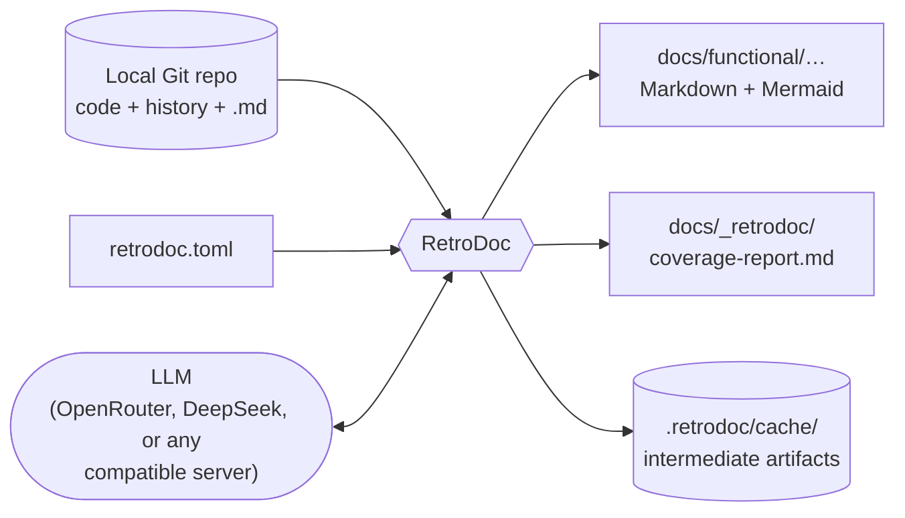
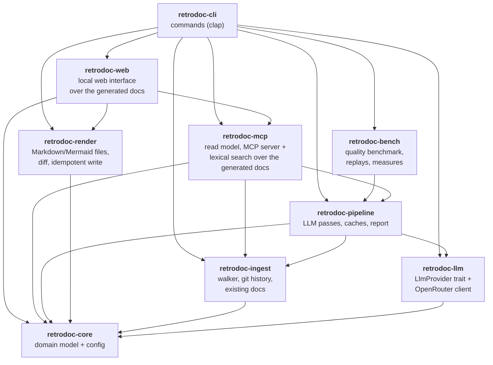
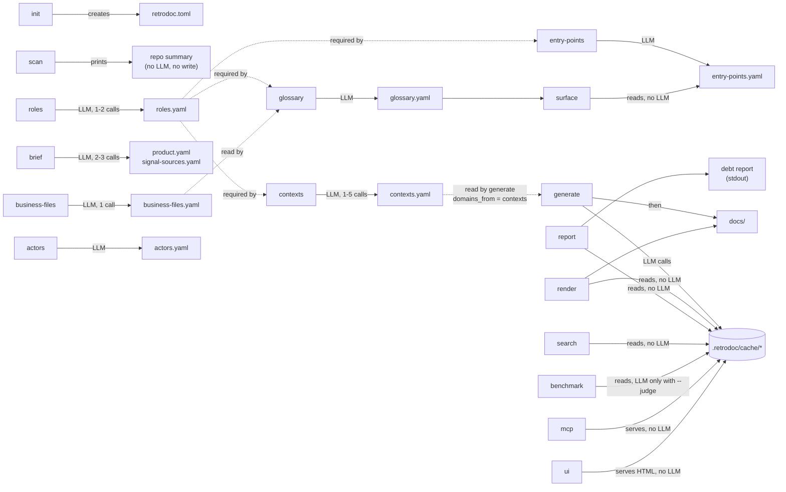
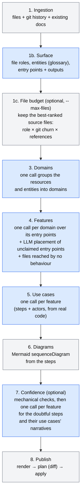
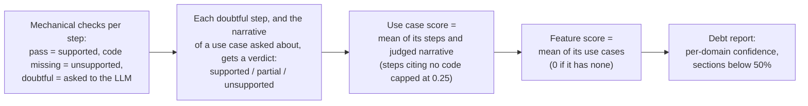
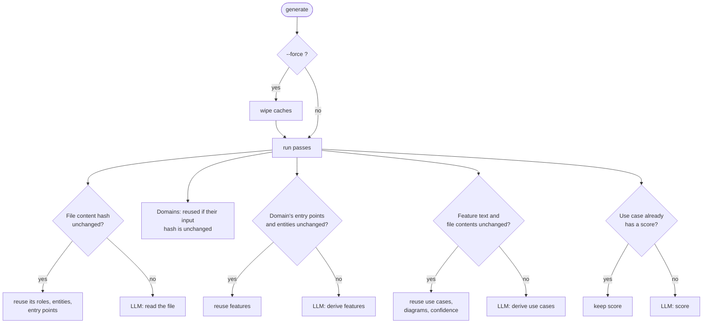
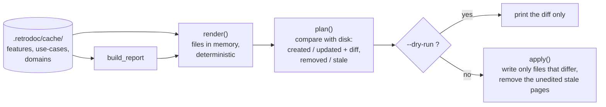
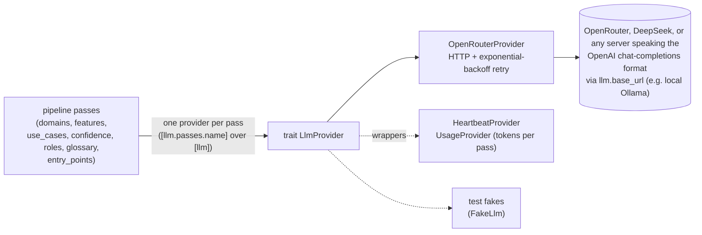
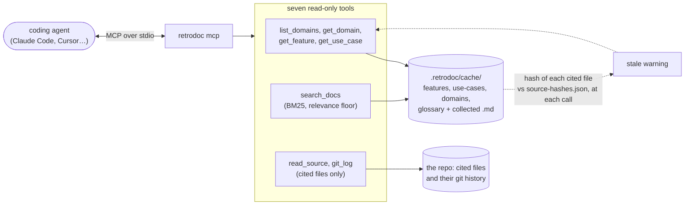

# RetroDoc architecture (high level)

This page explains **how RetroDoc works** with a few simple diagrams. It is a map, not a spec: for the
roadmap see [`ROADMAP.md`](../ROADMAP.md), for the rationale behind each choice [`docs/adr/`](adr/) and the dated
findings in [`findings.md`](findings.md), for the product vision see [`PRODUCT.md`](../PRODUCT.md), and for per-module details read the doc comments in the code.

## 1. What RetroDoc does

RetroDoc reads a local Git repo (code, commit history, existing Markdown) and asks an LLM, step by
step, to rebuild the **functional documentation** the project never had: domains → features → use
cases → diagrams, each with a **confidence score** telling how well the code supports the claim.


```mermaid
flowchart LR
    repo[("Local Git repo<br/>code + history + .md")] --> rd{{RetroDoc}}
    cfg["retrodoc.toml"] --> rd
    llm(["LLM<br/>(OpenRouter, DeepSeek, or any<br/>compatible server)"]) <--> rd
    rd --> docs["docs/functional/…<br/>Markdown + Mermaid"]
    rd --> rep["docs/_retrodoc/<br/>coverage-report.md"]
    rd --> cache[(".retrodoc/cache/<br/>intermediate artifacts")]
```

## 2. The crates

Nine crates; dependencies only point downwards (no cycles).


```mermaid
flowchart TD
    cli["<b>retrodoc-cli</b><br/>commands (clap)"]
    pipe["<b>retrodoc-pipeline</b><br/>LLM passes, caches, report"]
    render["<b>retrodoc-render</b><br/>Markdown/Mermaid files,<br/>diff, idempotent write"]
    mcp["<b>retrodoc-mcp</b><br/>read model, MCP server +<br/>lexical search over the generated docs"]
    bench["<b>retrodoc-bench</b><br/>quality benchmark,<br/>replays, measures"]
    web["<b>retrodoc-web</b><br/>local web interface<br/>over the generated docs"]
    ingest["<b>retrodoc-ingest</b><br/>walker, git history,<br/>existing docs"]
    llm["<b>retrodoc-llm</b><br/>LlmProvider trait +<br/>OpenRouter client"]
    core["<b>retrodoc-core</b><br/>domain model + config"]

    cli --> pipe
    cli --> render
    cli --> ingest
    cli --> llm
    cli --> mcp
    cli --> web
    cli --> bench
    bench --> pipe
    web --> mcp
    web --> render
    web --> core
    mcp --> pipe
    mcp --> ingest
    mcp --> core
    pipe --> ingest
    pipe --> llm
    pipe --> core
    render --> core
    ingest --> core
    llm --> core
```

| Crate | Role in one sentence |
|---|---|
| `retrodoc-core` | Shared vocabulary: `Domain`, `Feature`, `UseCase`, `Step`, `ConfidenceScore`, and the `retrodoc.toml` config. |
| `retrodoc-ingest` | Reads the repo: files (honouring `.gitignore`, classified `Source`/`Test`/`Markdown`/`Other`), git history in one pass, existing docs, and the code structure (tree-sitter definitions and references, [ADR 0022](adr/0022-tree-sitter-for-code-structure.md), [ADR 0027](adr/0027-parse-to-cut-long-files-and-opt-in-short-bodies.md)). What it knows of given stacks only accelerates: every pass works without it ([ADR 0036](adr/0036-language-and-framework-agnostic-by-design.md), `specs/language-agnostic.md`). |
| `retrodoc-llm` | Talks to the model. `LlmProvider` is a trait; the implementation is `OpenRouterProvider`, for `openrouter` and `deepseek` (HTTP, retry with backoff on 429/5xx). `UsageProvider` wraps it to count calls and tokens per pass. |
| `retrodoc-pipeline` | The brain: one module per pass, plus caches, fingerprints and the debt report. |
| `retrodoc-bench` | The measuring tools, out of the product code: the quality benchmark behind `retrodoc benchmark` and `benchmark-table`, the replays of one pass on frozen inputs and the measuring examples ([ADR 0042](adr/0042-the-measuring-tools-live-in-a-crate-of-their-own.md)). |
| `retrodoc-render` | Turns the result into Markdown files, compares with disk, writes only what changed. |
| `retrodoc-mcp` | Read-only access to the generated docs, without any LLM call: the typed read model `GeneratedDocs`, the BM25 search behind `retrodoc search` and the MCP server for LLM agents (`retrodoc mcp`, `rmcp`, stdio) with its seven read-only tools; also the snapshots of the run history that `generate` saves and the difference between two of them ([ADR 0043](adr/0043-the-run-history-is-one-snapshot-file-per-run.md)), and the store of the human reviews of the sections ([ADR 0044](adr/0044-the-human-reviews-live-in-one-file-outside-the-cache.md)). |
| `retrodoc-web` | The local web interface over the generated docs: HTML pages rendered on the server (`axum`, `askama`, vendored `htmx` and `mermaid`) from the read model of `retrodoc-mcp` and the rules of `retrodoc-render` (the doc links, the set-apart section), no LLM call, nothing written ([ADR 0039](adr/0039-a-server-rendered-web-interface-over-the-generated-docs.md)). |
| `retrodoc-cli` | The `retrodoc` binary: parses arguments and wires the crates together. |

## 3. The commands


```mermaid
flowchart LR
    init["init"] -->|creates| toml["retrodoc.toml"]
    scan["scan"] -->|prints| sum["repo summary<br/>(no LLM, no write)"]
    gen["generate"] -->|LLM calls| art[(".retrodoc/cache/*")]
    gen -->|then| out["docs/"]
    ren["render"] -->|reads, no LLM| art
    ren --> out
    rep["report"] -->|reads, no LLM| art
    rep --> debt["debt report<br/>(stdout)"]
    roles["roles"] -->|LLM, 1-2 calls| rolesyaml["roles.yaml"]
    brief["brief"] -->|LLM, 2-3 calls| prodyaml["product.yaml<br/>signal-sources.yaml"]
    biz["business-files"] -->|LLM, 1 call| bizyaml["business-files.yaml"]
    ctx["contexts"] -->|LLM, 1-5 calls| ctxyaml["contexts.yaml"]
    rolesyaml -.->|required by| ctx
    ctxyaml -.->|read by generate<br/>domains_from = contexts| gen
    gloss["glossary"] -->|LLM| glossyaml["glossary.yaml"]
    rolesyaml -.->|required by| gloss
    bizyaml -.->|read by| gloss
    ep["entry-points"] -->|LLM| epyaml["entry-points.yaml"]
    act["actors"] -->|LLM| actyaml["actors.yaml"]
    rolesyaml -.->|required by| ep
    surf["surface"] -->|reads, no LLM| epyaml
    glossyaml --> surf
    srch["search"] -->|reads, no LLM| art
    bench["benchmark"] -->|reads, LLM only with --judge| art
    mcpcmd["mcp"] -->|serves, no LLM| art
    uicmd["ui"] -->|serves HTML, no LLM| art
```

- `generate` is the main command; `render` and `report` replay the *last* `generate` without any LLM call.
- `roles`, `business-files`, `glossary` and `entry-points` (phase 7) are also run, incrementally, by `generate` as its "surface" step (the business files are read once for both the glossary and the entry points, [ADR 0028](adr/0028-read-the-business-files-once-for-entities-and-entry-points.md); `[pipeline] business_read = false` turns it off); the standalone commands let you run and inspect each one. `surface` prints what the domain clustering receives from them (no LLM).
- `contexts` (ADR 0029) maps the application into bounded contexts: the source files are grouped around the names of the entry point files, then one LLM call merges the groups, sets the technical ones aside and places the orphan folders; the files of a layer context and the groups of a catch-all go to the contexts that write their names, and a context over 150 files is split again. `contexts.yaml` is hand-editable and kept until `--force`, which keeps the slugs of the saved contexts its new ones mostly match and proposes the saved support to the call. With `domains_from = "contexts"`, `generate [--context a,b] [--max-files N]` documents some contexts at a time and leaves the others as they were.
- `brief` (ADR 0019) first locates where the schema, migrations and translations are (content sniffing, then one LLM call whose rules are checked on the real files), gathers the non-code evidence of the repo (docs, commit subjects, manifests, tree, schema, translations, tests, `.feature` files) and writes the product brief from a bounded sample of it, each claim citing its sources. `--signals` only prints the volume of evidence (no LLM). `generate` writes it first when there is none, then uses the saved one as it is (unless, unedited, it was asked in another language than `[output] language`); it heads the prompts of the later passes, and editing it redoes the passes that read it. With `brief.evidence` (on by default, `false` turns it off) features and use cases also get, per unit, the few doc sections, test descriptions and commit subjects closest to it (BM25, about 3,000 characters), which are part of that unit's fingerprint.
- `benchmark` scores the last run against a hand-written reference (`benchmark/<repo>/reference.yaml`, pairs in `matches.yaml`): sizes, scores, cost, recall and precision of domains and features. With `--judge` the LLM pairs the reference items the names leave uncovered (a generated item may hold several), then the generated items still unpaired with the covered reference items, and rates the narratives; its verdicts go to `.retrodoc/benchmark/judge.yaml` and never override the hand-written pairs; the ones `matches.yaml` rejects don't count, and the ones no hand has audited are counted. `benchmark-table` puts the saved runs of several configurations side by side (mean, range, change against a previous benchmark; the scored figures only under the same `SCORING_VERSION`, saved in each run; `benchmark --saved-judge` re-scores a saved run with no LLM call, `--second-call` adding only the judge's second call a `judge.yaml` saved before scoring version 5 lacks); `just benchmark` runs the whole loop on a pinned public repository.
- `search "<query>"` ranks the generated docs and the collected docs lexically (no LLM). `mcp` serves them to a coding agent over stdio (`list_domains`, `get_domain`, `get_feature`, `get_use_case`, `search_docs` — the business rules, when `[pipeline] rules` produced some, are in the first three and found by the search, with their evidence —, plus `read_source` and `git_log` on the files the docs cite, the history followed across renames (`specs/file-history.md`); no LLM, the agent reasons): the first form of "ask the documentation" (phase 9, `docs/findings.md` §4). Answers warn when a cited file changed since generation (its hash against the one in `source-hashes.json`, written only by a complete `generate`); the code and git tools refuse any file the docs don't cite and anything outside the repo root. `ui` serves them to a human in a browser (`retrodoc-web`, [ADR 0039](adr/0039-a-server-rendered-web-interface-over-the-generated-docs.md), `specs/web-ui.md`): on `127.0.0.1:8730` unless `--bind`, the docs and the git history that ranks their debt read once at start; the cited code and its history are shown through the same narrow `SourceAccess` as `read_source` (the files the docs cite, plus the files the debt page lists as covered by no doc), the files page lists the paths of the source files of the run with what cites them; a search box on every page asks the same index and limit as `retrodoc search`, and the glossary, the collected docs and the business rules (filtered by kind, domain and feature) have their pages, a matrix shows which actors take part in the use cases of each feature, and the history page compares two saved runs (`specs/history-page.md`).

## 4. The `generate` pipeline

This is the core flow. Blue-ish steps call the LLM; the others are deterministic. The domains and features
come from the surface (ADR 0020, ADR 0034); the `files` path, an LLM summary of every file and directory
clustered into domains (ADR 0004), was removed ([ADR 0035](adr/0035-remove-the-files-path.md)). With
`[pipeline] domains_from = "contexts"` the same passes run a bounded context at a time (§5).


```mermaid
flowchart TD
    A["1. Ingestion<br/>files + git history + existing docs"]:::det
    S["1b. Surface<br/>file roles, entities (glossary),<br/>entry points + outputs"]:::llm
    K["1c. File budget (optional, --max-files)<br/>keep the best-ranked source files:<br/>role × git churn × references"]:::det
    C["3. Domains<br/>one call groups the resources<br/>and entities into domains"]:::llm
    D["4. Features<br/>one call per domain over its entry points<br/>+ LLM placement of unclaimed entry points<br/>+ files reached by no behaviour"]:::llm
    E["5. Use cases<br/>one call per feature<br/>(steps + actors, from real code)"]:::llm
    F["6. Diagrams<br/>Mermaid sequenceDiagram<br/>from the steps"]:::det
    G["7. Confidence (optional)<br/>mechanical checks, then one call per feature<br/>for the doubtful steps<br/>and their use cases' narratives"]:::llm
    H["8. Publish<br/>render → plan (diff) → apply"]:::det

    A --> S --> K --> C --> D --> E --> F --> G --> H

    classDef llm fill:#dbeafe,stroke:#2563eb,color:#000
    classDef det fill:#f3f4f6,stroke:#6b7280,color:#000
```

What each pass hands to the next, and where it is saved:

| # | Pass (module) | Input | Output | Saved in `.retrodoc/cache/` |
|---|---|---|---|---|
| 1 | ingest (`retrodoc-ingest`) | repo path | files, history, existing docs | — (recomputed) |
| 1c | `ranking.rs` (only with a budget) | source files + roles + history + references | the N best-ranked files; the rest is left out | `scope.yaml` |
| 3 | `domains/from_surface.rs` | the surface (entities, entry points by resource) + the brief | `DomainMap` (flat domains of resources and entities) | `domains.yaml` |
| 4 | `features/from_surface/` + `behaviour_coverage.rs` | one domain + its entry points and entities | `Feature`s holding entry points, the technical ones set aside; the entry points no feature holds and the files reached by no behaviour | `features.yaml`, `features-set-aside.yaml`, `behaviour-coverage.yaml` |
| 5 | `use_cases/` | one feature + its entry points + the code they run (`slices.rs`) + the business actors (`actors.rs`), else its files' excerpts | `UseCase`s with steps and actors | `use-cases.yaml` |
| 5b | `rules/` (`[pipeline] rules`, on by default, [ADR 0021](adr/0021-business-rules-as-a-model-object.md)) | one feature + the same code as its use cases + its entities + the closest doc sections and test descriptions | `BusinessRule`s with cited code, tests and docs, and a confidence; a feature about tests gets no rules (one question on its name and description), then a second call per feature drops the noise (storage, screen, test, technical), then the rule several features state is kept once (no LLM) | `rules-stated.yaml` (per feature), `rules-set-aside.yaml` (to check; `[rules]` of `retrodoc.toml` puts a wrong case back), `rules.yaml` |
| 6 | `diagrams.rs` | use case steps (the technical level; each use case also carries a business `narrative`) | Mermaid text attached to each use case | `use-cases.yaml` |
| 6b | `vocabulary.rs` | use case narrative + entity/actor names | business-language score on each use case (no LLM) | `use-cases.yaml` |
| 7 | `confidence/` | use case + the code its steps cite | scores on use cases and features | `features.yaml`, `use-cases.yaml` |
| 7b | `reconcile/` (`[pipeline] reconcile`, on by default, [ADR 0033](adr/0033-reconcile-with-existing-docs-lexical-match-then-llm-judge.md)) | each domain, feature, use case and rule + the doc sections BM25 matches to it by its text, else by its code names (entry points, entities), which docs in another language share (generated docs left out) | per section `covers`, `contradicts` (with what each side states) or `unrelated`; no call for an item no section matches, nor for an unchanged one | `reconciliation.yaml` |
| 8 | `report/` + `retrodoc-render` | all of the above | Markdown files + debt report | — (written to `docs/`) |

### Safety nets built into the passes

- **Behaviours are covered, not files** ([ADR 0020](adr/0020-cover-behaviours-not-files.md)). An entry point no
  feature holds is placed by one more LLM call; what stays out, and the source files no behaviour reaches, are
  reported (`behaviour-coverage.yaml`, the debt report) rather than forced into a domain. A surface with no entity
  and no entry point documents no domain, with a warning.
- **Lenient JSON.** LLM answers are parsed leniently (first JSON value, code fences tolerated, a repeated field keeps its last value). An
  unparseable answer is retried once, then that single unit is skipped with a warning instead of
  aborting the run (`response.rs`).
- **Grounding.** Source references to files outside the feature are dropped; a use case that cites no
  readable code scores 0 without even calling the LLM.
- **Reads stay in the repo.** Every source read goes through `text::read_file_lossy` (or `read_file_prefix_lossy` for a
  bounded prefix), which treats as unreadable a path that is absolute, has a `..` or resolves outside the repository
  through a symbolic link: a path edited in a saved artifact can't point a prompt at a file outside the repository.
- **Artifact paths stay in the walk.** A path cited by a saved artifact is read only when it is one of the
  `WalkedFiles` (`walked.rs`), the files of this run's walk taken before the budget: the `source_refs` of
  `use-cases.yaml` and the files of `features.yaml` are read through `WalkedFiles::read` (prompts, rules input,
  fingerprints), and `FeatureInput` leaves out the entry points of `entry-points.yaml` in a file the walk lacks. A
  file the walker skips (gitignored `.env`, `.git/config`) reads as unreadable and never reaches a prompt.

### How the confidence score is computed


```mermaid
flowchart LR
    c["Mechanical checks per step:<br/>pass = supported, code missing = unsupported,<br/>doubtful = asked to the LLM"] --> s["Each doubtful step, and the narrative<br/>of a use case asked about, gets a verdict:<br/>supported / partial / unsupported"]
    s --> u["Use case score =<br/>mean of its steps and judged narrative<br/>(steps citing no code capped at 0.25)"]
    u --> f["Feature score =<br/>mean of its use cases<br/>(0 if it has none)"]
    f --> r["Debt report:<br/>per-domain confidence,<br/>sections below 50%"]
```

Only the doubtful steps are sent to the LLM ([ADR 0026](adr/0026-check-use-case-steps-mechanically-before-asking-the-llm.md)); `--confidence-sample` adds a second opinion on use cases that pass every check. The narrative of a use case sent to the LLM is judged in the same call ([ADR 0038](adr/0038-check-the-narrative-in-the-confidence-call.md), `specs/use-case-confidence.md`) and its verdict kept as `narrative_check`, `unsupported` only for a claim the shown code contradicts (a claim it does not show is `partial`), the report listing the `unsupported` ones; a use case the checks settle makes no call for it. An unparseable verdict leaves the use case **unscored** (`None`), which the report lists separately.

## 5. Incremental re-run

Re-running `generate` should not pay for the LLM twice. Fingerprints and content hashes decide what to
skip:


```mermaid
flowchart TD
    start(["generate"]) --> force{"--force ?"}
    force -- yes --> wipe["wipe caches"] --> redo
    force -- no --> redo["run passes"]

    redo --> p2{"File content hash<br/>unchanged?"}
    p2 -- yes --> r2["reuse its roles, entities,<br/>entry points"]
    p2 -- no --> c2["LLM: read the file"]

    redo --> p3["Domains: reused if their input<br/>hash is unchanged"]

    redo --> p4{"Domain's entry points<br/>and entities unchanged?"}
    p4 -- yes --> r4["reuse features"]
    p4 -- no --> c4["LLM: derive features"]

    redo --> p5{"Feature text and<br/>file contents unchanged?"}
    p5 -- yes --> r5["reuse use cases,<br/>diagrams, confidence"]
    p5 -- no --> c5["LLM: derive use cases"]

    redo --> p7{"Use case already<br/>has a score?"}
    p7 -- yes --> r7["keep score"]
    p7 -- no --> c7["LLM: score"]
```

The model of the pass is part of every one of these comparisons, and so is its request: its system prompt, the
schema of its answer and the fixed texts of its user prompt (ADR 0037, ADR 0040). Ask a pass for another model,
or change its request, and its units are redone once (the hand-editable roles, sources, business files and brief are only redone with `--force`).
Domain clustering is not deterministic, so
`domains.yaml` is reused while its input hash is unchanged (otherwise downstream fingerprints would be
invalidated, see `docs/findings.md`): the surface (entities and resources), the brief and the model. The features are one call per domain over its
entry points (keyed on them and the domain's entities) and the use cases read those entry points. With `[pipeline] domains_from = "contexts"` (ADR 0029) a run documents a slice of the application, some bounded contexts of `contexts.yaml`: it reads their files only, keeps the inventories, features and use cases of the others as they are (`Retention::Others`, per-domain vocabulary, frozen actors) and marks its contexts done. The passes save after each answer
(features, use cases, rules, confidence) and every artifact is written beside then renamed, so a run
that fails or is killed mid-pass loses the call in flight and the next run resumes there. The
`llm.concurrency` (use cases, rules and confidence) setting and the `--no-confidence` / `--confidence-sample` /
`--max-files` flags bound the cost of a run.

## 6. Publishing the docs (no LLM)

`generate` ends with the same code path that the `render` command runs alone.


```mermaid
flowchart LR
    art[(".retrodoc/cache/<br/>features, use-cases,<br/>domains")] --> rpt["build_report"]
    art --> rnd["render()<br/>files in memory,<br/>deterministic"]
    rpt --> rnd
    rnd --> pl["plan()<br/>compare with disk:<br/>created / updated + diff,<br/>removed / stale"]
    pl --> dry{"--dry-run ?"}
    dry -- yes --> show["print the diff only"]
    dry -- no --> app["apply()<br/>write only files that differ,<br/>remove the unedited stale pages"]
```

Guarantees:

- **Idempotent**: same artifacts → same bytes → nothing written. The timestamp in
  `_retrodoc/run-metadata.json` is ignored when it is the only difference.
- **Non-destructive**: a page under `functional/` the run no longer produces (an item renamed or gone) is removed
  only while its content still has the hash recorded in `_retrodoc/rendered-pages.json` when it was written; an edited
  or unrecorded one is reported, never deleted (`specs/docs-pruning.md`).
- **No feedback loop**: `functional/` and `_retrodoc/` are removed from the "existing docs" read at
  ingestion, so generated docs are never fed back to the LLM.

## 7. What lands on disk

```
<target repo>/
├── retrodoc.toml                  # config (LLM model, ignores, docs dir) — you edit this
├── .retrodoc/reviews.json         # the human reviews of the sections, outside the cache: no `generate` touches it (ADR 0044, `specs/section-review.md`)
├── .retrodoc/cache/               # intermediate artifacts (pipeline state)
│   ├── source-hashes.json         #   hash of each source file at the last complete run (MCP freshness)
│   ├── domains.yaml               #   domain clustering
│   ├── features.yaml              #   features (+ confidence)
│   ├── features-set-aside.yaml    #   features the features pass marked technical, out of the docs, listed in the report
│   ├── use-cases.yaml             #   use cases, steps, diagrams (+ confidence)
│   ├── fingerprints.json          #   what the incremental re-run compares against
│   ├── behaviour-coverage.yaml    #   entry points without a feature (per context in contexts mode) or without a use case (per feature), files reached by no behaviour
│   ├── scope.yaml                 #   files left out by the budget (`--max-files`), listed in the report
│   ├── roles.yaml                 #   (phase 7) glob → role rules, hand-editable
│   ├── roles-unmatched.yaml       #   (phase 7) rules of the files roles.yaml leaves unmatched, hand-editable
│   ├── signal-sources.yaml        #   where the schema, migrations and translations are, hand-editable
│   ├── product.yaml               #   product brief (ADR 0019), hand-editable
│   ├── business-files.yaml        #   ranked files and directories that hold the business, hand-editable
│   ├── contexts.yaml              #   bounded contexts (ADR 0029): groups, folders and placed files per context, hand-editable
│   ├── glossary.yaml              #   (phase 7) business entities, also its own cache
│   ├── entry-points.yaml          #   (phase 7) routes/commands/jobs + outputs, also its own cache
│   ├── actors.yaml                #   (phase 7) business actors, reused while its input hash is unchanged
│   ├── reconciliation.yaml        #   verdicts of the existing doc sections on the items (ADR 0033), with the fingerprints they hold for
│   ├── usage.json                 #   calls, tokens (and cached prompt tokens) and time per pass of the last 20 runs (see ADR 0015)
│   └── history/                   #   one snapshot per `generate` that changed the docs: figures, debt, scores per section; all kept, `--force` included (ADR 0043); the history page compares two (`specs/history-page.md`)
└── docs/                          # output dir (`output.docs_dir`)
    ├── functional/llms.txt        #   index for agents that don't run the MCP server
    ├── functional/<domain>/…      #   README per domain, feature pages, use-case pages
    ├── functional/rules.md        #   (with `[pipeline] rules`) business rules by entity; also on the feature, use case and domain pages
    └── _retrodoc/
        ├── coverage-report.md     #   documentation debt report
        ├── run-metadata.json      #   model, commit, timestamp
        └── rendered-pages.json    #   hash of each page written under functional/ (removal of stale pages)
```

## 8. The LLM boundary

All model access goes through one trait, so passes can be tested with a fake and a second provider can
be added later without touching the pipeline.


```mermaid
flowchart LR
    passes["pipeline passes<br/>(domains, features,<br/>use_cases, confidence, roles, glossary,<br/>entry_points)"] -->|"one provider per pass<br/>([llm.passes.name] over [llm])"| trait["trait LlmProvider"]
    trait --> or["OpenRouterProvider<br/>HTTP + exponential-backoff retry"]
    trait -.->|wrappers| wrap["HeartbeatProvider<br/>UsageProvider (tokens per pass)"]
    trait -.-> fake["test fakes<br/>(FakeLlm)"]
    or --> ep[("OpenRouter, DeepSeek, or any server speaking the<br/>OpenAI chat-completions format<br/>via llm.base_url (e.g. local Ollama)")]
```

Each pass gets its own provider: `[llm.passes.<name>]` in `retrodoc.toml` changes the model, server or key
of one pass and falls back to `[llm]` for the rest, so a strong model can frame the documentation (brief,
domains, features) while a cheap or local one does the many extractions. Passes with equal settings share
one provider. The model is part of each pass's fingerprint (§5), so changing it redoes the pass. See
[ADR 0023](adr/0023-structured-outputs-and-a-model-per-pass.md).

With `[output] language` set, the provider of each pass that writes text a reader sees is wrapped in
`InLanguage` (`retrodoc-pipeline`), which ends every system prompt with one instruction naming the language and
whose model names it too, so changing the language redoes those passes; the reading passes keep the plain
provider. The fixed text around the generated text (the headings and labels of the render, the pages of
`retrodoc ui` and their `lang`) follows the language too, from a table per language in `retrodoc-render` and
`retrodoc-web` (English and French; English for any other). See
[ADR 0041](adr/0041-the-language-of-the-docs-wraps-the-provider-of-a-writing-pass.md) and
`specs/docs-language.md`.

## 9. Serving the docs to agents (MCP)

A coding agent can query the generated docs instead of reading them all. `retrodoc mcp` is a read-only MCP
server over stdio that calls no LLM: the agent reasons, the server only looks things up. Why it is built
this way: [ADR 0016](adr/0016-read-only-llm-free-mcp-server-for-agents.md).


```mermaid
flowchart LR
    agent(["coding agent<br/>(Claude Code, Cursor…)"]) <-->|"MCP over stdio"| srv["retrodoc mcp"]
    subgraph tools["seven read-only tools"]
        nav["list_domains, get_domain,<br/>get_feature, get_use_case"]
        srch["search_docs<br/>(BM25, relevance floor)"]
        code["read_source, git_log<br/>(cited files only)"]
    end
    srv --> tools
    nav --> art[(".retrodoc/cache/<br/>features, use-cases, domains,<br/>glossary + collected .md")]
    srch --> art
    code --> repo[("the repo: cited files<br/>and their git history")]
    art -.->|"hash of each cited file<br/>vs source-hashes.json, at each call"| fresh["stale warning"]
    fresh -.-> nav
```

- Answers are Markdown with the id to follow, the confidence (flagged below 50%) and the cited files;
  an unknown id or an empty search is "Not documented", never an error; ids resolve as `specs/mcp-server.md` says.
- `read_source` and `git_log` reach only files the docs cite, and refuse `..`, absolute paths, symbolic links,
  binary and very large files.
- For agents that don't run the server, `render()` also writes `functional/llms.txt`, an index of the domains and
  features with links and confidence.
- stdout carries the protocol, so the logs of `retrodoc mcp` go to stderr.

## 10. Where to go next

| I want to… | Look at |
|---|---|
| Know what is planned / out of scope | `ROADMAP.md` (milestones), `PRODUCT.md` "Scope of v1" (out of scope) and "Risks", `docs/findings.md` (dated findings, §7: the review of 2026-10-12), `just next-issue` (the open issues by rank) |
| Add or change a pipeline pass | `crates/retrodoc-pipeline/src/` (follow the existing pass + its fake-provider test) |
| Change the benchmark, a replay or a measure | `crates/retrodoc-bench/` (`src/benchmark/`, `examples/`), `docs/crates/bench.md` |
| Change the generated Markdown | `crates/retrodoc-render/src/markdown/` (one file per page) |
| Change what an agent can ask (MCP tools, search, code access) | `crates/retrodoc-mcp/src/` (`tools/` the answers, `server.rs` the wiring, `source.rs` the code access scope) |
| Change what the web interface shows | `crates/retrodoc-web/` (`view.rs` what a page shows, `code.rs`, `files.rs`, `collected.rs`, `glossary.rs`, `rules.rs`, `debt.rs`, `audit.rs` (with `trends.rs`), `history.rs`, `actors.rs`, `map.rs` and `search.rs` the other pages, `templates/` the layout, `pages.rs` the routes), `specs/web-ui.md`; the data comes from `GeneratedDocs` in `crates/retrodoc-mcp/src/read_model.rs` |
| Add a CLI command | `crates/retrodoc-cli/src/commands/` + `main.rs` |
| Change config options | `crates/retrodoc-core/src/config.rs` |
| Understand why a design choice was made | `docs/adr/` (ADRs 0001–0014 were written retroactively from the history; 0015 to 0018 were written with the change; 0019 to 0023 decide the redesign of `docs/findings.md` §6 ahead of its implementation; 0024 adds DeepSeek as a provider; 0025 locates the business files with a pass of its own; 0026 to 0028 record measured steps of the redesign: mechanical confidence checks, chunking by parse, single read of the business files) |
